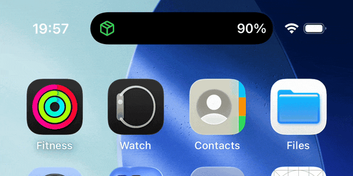
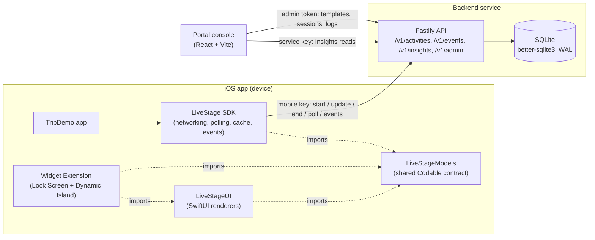
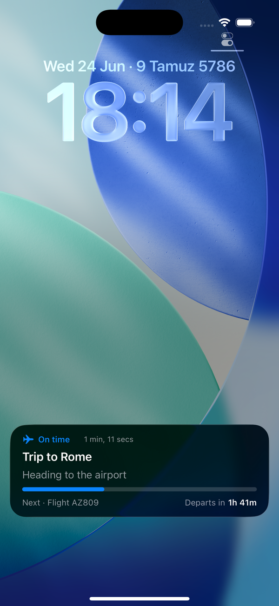
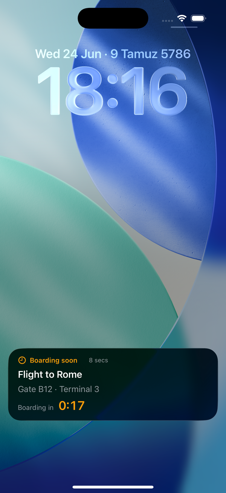
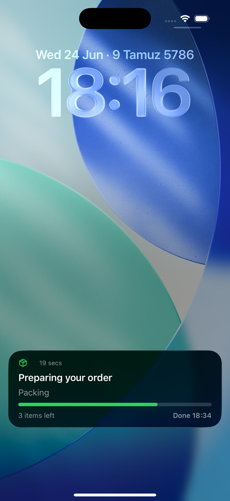
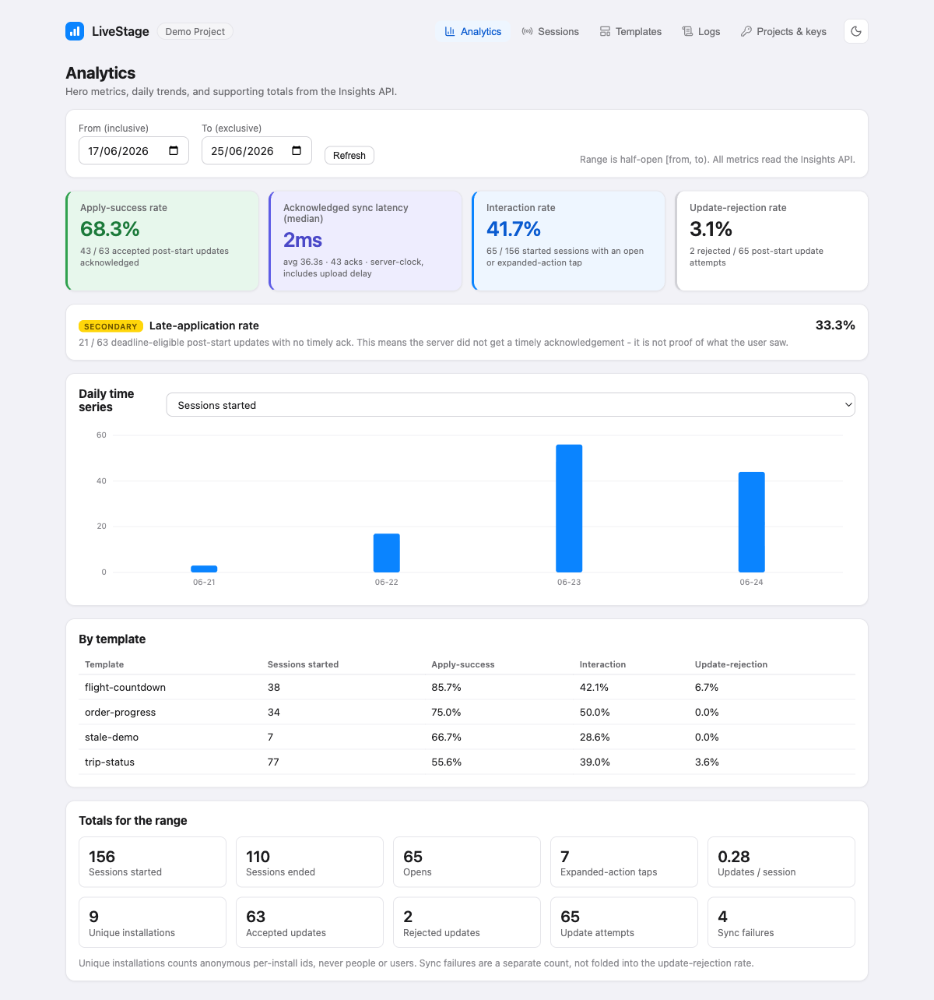
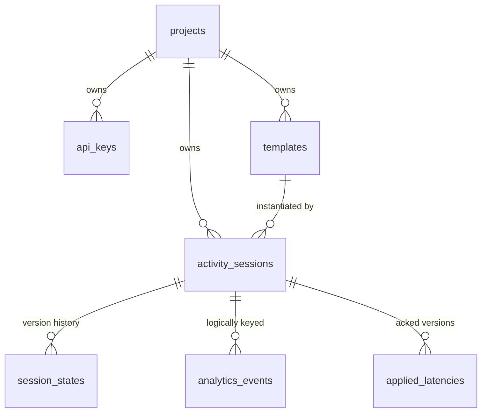

# LiveStage

LiveStage is a guided-integration iOS SDK and analytics service for adding configurable
**Live Activities** (Lock Screen and Dynamic Island). A developer picks one of three semantic
templates, supplies typed state, and the SDK renders it natively across every surface. The SDK
also reports lifecycle, delivery, and interaction events; the backend validates, stores, and
aggregates them; and an Insights API returns statistics to the developer. Content, branding, and
lifecycle are managed from a developer console (the portal) that visualizes those same APIs.

<p align="center">
  <a href="docs-site/public/island-expand.gif"></a>
</p>

Positioning, stated precisely: LiveStage is **server-configurable and state-driven, with native
layouts compiled into the SDK**. The Live Activity views are native SwiftUI compiled into the
widget extension, so a server cannot ship layout code. It is not "fully server-driven" and you do
not design layouts in a browser. The server controls which template, the typed state, the
branding, and the lifecycle. The SDK owns the pixels.

The piece that makes LiveStage a service (not just a UI library) is the closed loop:
render and update, report events, aggregate, Insights API, visualize.

What LiveStage saves you from building yourself:

- The ActivityKit state plumbing (request, content updates, lifecycle, the activity-id mapping).
- The Lock Screen and Dynamic Island layouts, across all three island presentations.
- Backend session and version management, with forward-only, server-authoritative state.
- Update idempotency, retry with backoff, and offline event upload.
- Analytics aggregation behind an Insights API, with honest metrics only.
- A developer console for authoring templates and testing live updates by hand.

## System architecture

The seven separated parts and how they talk. The Live Activity views are native SwiftUI compiled
into the widget extension; the backend never ships layout, only template config, typed state, and
the Insights numbers.



## How LiveStage works end to end

The mental model in one pass, so the moving parts make sense before you read the details:

1. **Author once.** In the portal you create a project, generate keys, and define a template (its
   type, branding, labels, deep-link base, and stale window). The template id is the string the app
   passes to `start`.
2. **Start an activity.** The app calls `LiveStage.start(templateId:...)`. The SDK fetches the
   template config, validates the typed state, creates the server session (the source of truth),
   then requests the ActivityKit activity and begins polling. The server session is created **before**
   the device activity; if the device request fails, the SDK ends the orphan session and rethrows.
3. **The server is authoritative.** State changes are versioned on the server, forward-only. An
   update can come from your app (`LiveStage.update`) or from a person editing the session in the
   portal. Either way it becomes a new server version.
4. **The SDK polls and applies.** Every poll interval (8s default) the SDK asks the server for the
   current version. If it is newer than what is applied, it pushes the new `ContentState` to the
   activity, which re-renders the Lock Screen and Dynamic Island. Versions less than or equal to the
   applied one are ignored.
5. **The device reports events.** As the activity starts, applies state, is opened, or ends, the SDK
   queues typed analytics events and uploads them in batches. This is automatic; the one thing you
   wire up is `handleDeepLink` so taps are recorded.
6. **The backend aggregates.** It validates and stores each event once (deduped by `eventId`),
   appends to raw history, and rolls up daily aggregates.
7. **You read the result.** The Insights API returns statistics behind a service key, and the portal
   dashboard visualizes those same numbers.

When the activity reaches a visually complete look (progress 1.0, countdown at zero, "arrived"), it
renders the completed appearance but is **not** locked. Updates are accepted until the app explicitly
calls `end`.

## The three templates

- **Journey** - a trip with a title, current step, optional next step, progress, target time, status.
- **Countdown** - a target time that ticks on-device, with a zero-state label when it reaches zero.
- **Progress** - a staged task with a 0..1 progress value and an estimated completion time.

<p align="center">
  <a href="docs-site/src/assets/screenshots/07-lockscreen-journey.png"></a>
  &nbsp;&nbsp;
  <a href="docs-site/src/assets/screenshots/08-lockscreen-countdown.png"></a>
  &nbsp;&nbsp;
  <a href="docs-site/src/assets/screenshots/09-lockscreen-progress.png"></a>
</p>

<p align="center"><sub>Journey, Countdown, and Progress on the Lock Screen. The Dynamic Island renders the same state across compact, expanded, and minimal.</sub></p>

## Repository layout (the seven separated parts)

```
swift/LiveStage/            one Swift package, three library products
  Sources/LiveStageModels/  shared data contract (Codable/Hashable), imported by every Swift side
  Sources/LiveStage/        the public SDK API + internal engine (networking, polling, cache, events)
  Sources/LiveStageUI/      native SwiftUI renderers + the ActivityConfiguration (the only place layout lives)
ios-demo/
  TripDemo/                 the demo app (depends on LiveStage)
  TripDemoWidget/           the Widget Extension starter (depends on LiveStageUI + LiveStageModels)
backend/                    Node + TypeScript + Fastify + SQLite (better-sqlite3), ESM, run via tsx
portal/                     React + Vite + TypeScript developer console
docs-public/                committed docs: integration guide + widget extension setup
```

The seven parts the project keeps separate: the public SDK API, the internal SDK engine, the
reusable Widget UI (`LiveStageUI`), the Widget Extension starter (`TripDemoWidget`), the backend,
the portal, and the demo app. `LiveStageModels` is the shared contract all Swift sides import; the
backend mirrors the same wire shapes in TypeScript.

## The public SDK API

The entire developer-facing surface is seven functions on the `LiveStage` enum:

```swift
LiveStage.configure(apiKey:baseURL:)
LiveStage.start(templateId:deepLinkParameters:state:) async throws -> LiveStageSession
LiveStage.update(_:state:) async throws
LiveStage.end(_:) async throws
LiveStage.fetchConfiguration(templateId:) async throws -> TemplateConfiguration
LiveStage.status(_:) async throws -> SessionStatus
LiveStage.handleDeepLink(_:) async throws -> LiveStageRoute?
```

See [docs-public/integration-guide.md](docs-public/integration-guide.md) for how to add LiveStage to
an app, [docs-public/widget-extension-setup.md](docs-public/widget-extension-setup.md) for the
Widget Extension starter, and [docs-public/portal-guide.md](docs-public/portal-guide.md) for what the
developer console does and how to operate it.

## Robustness (offline, retry, idempotency)

- **Offline state.** Killing the network mid-session leaves the last applied state on the Lock
  Screen and Dynamic Island; it goes stale via the activity's `staleDate`. Polling resumes on
  reconnect and applies the next forward version.
- **Durable caches.** Template configuration and the last applied state per session are persisted
  locally, so `fetchConfiguration` and `status` answer from cache when offline (a fresh fetch wins
  when the network is up). Analytics events are persisted to disk and survive app relaunch.
- **Upload on reconnect.** Queued events flush when the app returns to the foreground; the flush is
  single-flight so it cannot race the polling flush.
- **Retry and backoff.** Transport failures and `5xx` responses retry with exponential backoff;
  `4xx` responses do not retry.
- **Idempotency.** Each `update` carries one `clientMutationId` reused across its retries, so a lost
  response cannot create a duplicate server version. Each analytics event carries an `eventId` the
  backend dedupes, so re-uploading a batch never double-counts.

## Honest metrics

ActivityKit exposes no impression or visibility callback, so LiveStage never claims views,
impressions, dwell time, or how many times a Lock Screen displayed an activity. It reports
interactions and opens (taps on a deep link), distinct installations (never "unique users"), and
best-effort `dismissal_observed`. The four hero numbers are apply-success rate, acknowledged sync
latency, interaction rate, and update-rejection rate. Acknowledged latency is computed from the
server clock only (version `accepted_at` to `state_applied` `received_at`), never the device clock.

<p align="center">
  <a href="docs-site/src/assets/screenshots/04-analytics-populated.png"></a>
</p>
<p align="center"><sub>The portal analytics dashboard, reading the service-gated Insights API. Every rate shows its raw numerator and denominator.</sub></p>

## Running it locally

Prerequisites on this machine: Xcode 26.5, Swift 6.3.2, an iPhone 17 Pro or Pro Max simulator
(iOS 26.5). Dynamic Island needs a Pro simulator; the Lock Screen works on any simulator. The
SDK honors an iOS 16.2 minimum, so any newer API is guarded with `if #available`.

### Backend (port 8787)

```sh
cd backend
npm install
npm run seed     # creates the demo project, keys, and templates; writes backend/.seeded-keys.json (gitignored)
npm run dev      # or: npm start
```

`npm run seed` prints the `mobileKey`, the `serviceKey`, and the admin token. The seeded templates
are `trip-status` (journey), `flight-countdown` (countdown), `order-progress` (progress), and
`stale-demo` (a journey with a 20s stale window for testing). Re-seeding regenerates the keys, so
resync the demo app's key afterward (see below). Admin routes use `ADMIN_TOKEN` (default
`dev-admin-token`, local-demo-only). Other commands: `npm test` (node test runner, in-memory db),
`npx tsc -p .` (typecheck). The local db file `backend/livestage.db` is gitignored.

### Portal (port 5173)

```sh
cd portal
npm install
npm run dev      # calls the backend admin routes; CORS allows localhost
npm run build    # also typechecks
```

Config lives in `portal/src/config.ts`: `API_BASE` (default `http://localhost:8787`) and
`ADMIN_TOKEN` (default `dev-admin-token`), overridable via `VITE_API_BASE` and `VITE_ADMIN_TOKEN`.
The analytics dashboard talks to the real `/v1/insights/*` routes with a service key.

### SDK tests

```sh
swift test --package-path swift/LiveStage
```

### Demo app (TripDemo)

1. Seed the backend and copy the example secrets file:
   ```sh
   cp ios-demo/DevelopmentSecrets.xcconfig.example ios-demo/DevelopmentSecrets.xcconfig
   ```
   Paste the seeded `mobileKey` into `LIVESTAGE_API_KEY`. The file is gitignored.
2. Regenerate the Xcode project if you changed `ios-demo/project.yml`:
   ```sh
   xcodegen generate --spec ios-demo/project.yml
   ```
3. Build for the simulator:
   ```sh
   xcodebuild -project ios-demo/TripDemo.xcodeproj -scheme TripDemo \
     -destination 'platform=iOS Simulator,name=iPhone 17 Pro' build
   ```
4. Run it, edit state in the portal, and watch the Live Activity update within one poll interval.

To test on a physical iPhone, set `LIVESTAGE_API_HOST` to your Mac's LAN IP (not `localhost`) and
run the backend so it binds to that address.

## Security model (realistic V1)

Keys have the format `ls_<type>_<id>.<secret>`; only the secret's hash is stored, and the server
resolves the single row by `<id>` then verifies the secret (it never scans all hashes). There are
three planes: a `mobile` key (SDK writes and events, shippable), a `service` key (Insights reads,
server-only), and the admin token (portal and template management). The Insights API requires a
`service` key and rejects a `mobile` key; activity-mutation routes reject a `service` key. The
mobile key is not a true secret: server-side validation is the gate, not key possession.

## Data model

One SQLite file (`backend/livestage.db`, gitignored; tests run in-memory), defined in
`backend/src/db/schema.sql`. Three groups of tables: slow-changing **configuration**, the
live-activity **runtime state**, and the two-level **analytics** store.



- **Configuration** - `projects`, `api_keys` (only the secret's hash, resolved by public id), and `templates`.
- **Live state** - `activity_sessions` (status `active | ended`, server `version`, `attributes_json` frozen at start), `session_states` (the versioned payload history and latency anchor), plus `start_idempotency` / `rejected_mutations` retry guards and `logs`.
- **Analytics** - append-only `analytics_events` (identifiers and types only, never user content), pre-aggregated `daily_metrics`, and `applied_latencies` for the median-latency hero.

The Insights API computes range metrics from the raw tables and daily charts from `daily_metrics`;
it never echoes raw rows. See the full schema with every column in the
[Data model](https://yuvalkandov.github.io/LiveStage/data-model/) docs, and how a raw event becomes
a metric in [Analytics and metrics](https://yuvalkandov.github.io/LiveStage/analytics/).
