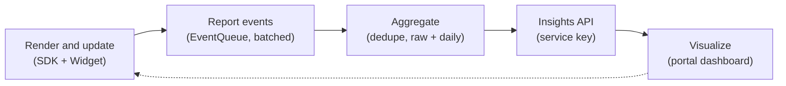
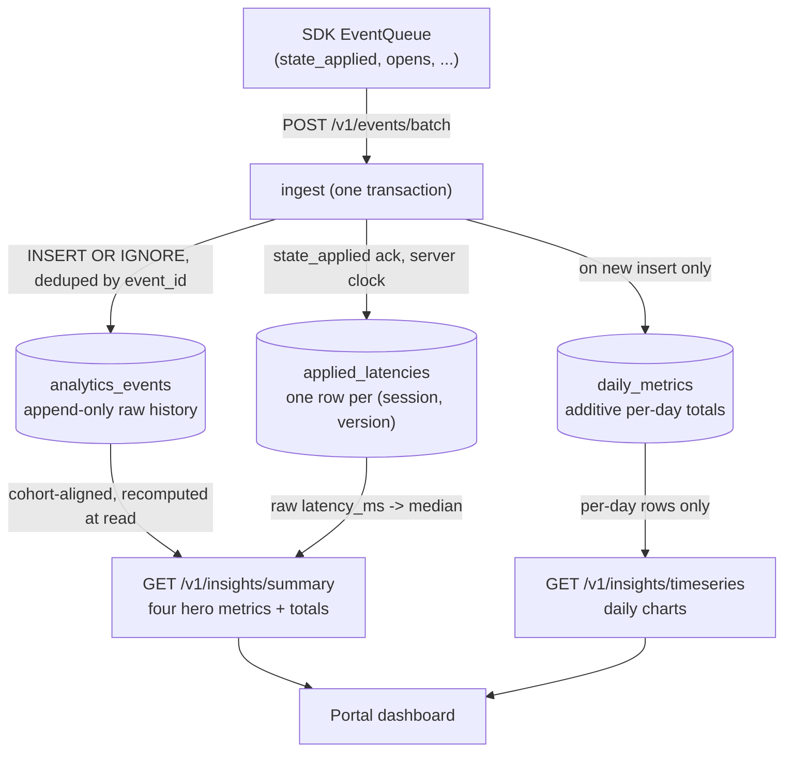

The piece that makes LiveStage a service, not just a UI library, is the closed loop: render and
update, report events, aggregate, Insights API, visualize. This page explains what the SDK reports,
how the backend turns it into numbers, and exactly what those numbers do and do not claim.

## The service loop



You do not instrument analytics. The SDK emits typed events on its own as the activity lives. The
**only** wiring you add is `handleDeepLink`, which turns a tap into an open event.

## What the SDK reports

The typed event set is fixed. Each event carries identifiers and types only, never any of your state
content and never a user identity.

| Event | When |
| --- | --- |
| `activity_started` | `start` succeeded and the activity was requested |
| `state_applied` | the SDK applied a server version to the activity (the sync ack) |
| `activity_opened` | a primary tap on the activity (via `handleDeepLink`) |
| `expanded_action_tapped` | a tap on an explicit Link in the expanded Dynamic Island |
| `activity_ended` | `end` was called |
| `sync_failed` | a poll or apply failed |
| `dismissal_observed` | a dismissal seen on-device while the app runs (best-effort) |

Every event carries a client `eventId` (UUID) for batch-upload dedupe and an anonymous
`installationId` (never a user identity). Events are queued, persisted to disk, batched, and deduped
by `eventId`, so you never count or upload anything yourself.

:::caution[Events never carry content]
OK in an event: `sessionId`, `installationId`, `templateId`, `eventType`, `version`, timestamps. Never
in an event: trip titles, locations, status text, or any state field. Content stays in the session's
state on the server, not in analytics.
:::

## How a raw event becomes a metric

Storage is two levels: an append-only raw history and pre-aggregated daily totals. The Insights API
computes from these; it never echoes raw rows back.



The range hero metrics are recomputed from the raw tables at read time with cohort alignment, so a
rollup error can never make a rate exceed 100%. `daily_metrics` only ever feeds additive per-day chart
rows. Distinct counts over a range (distinct installations, distinct sessions with an interaction) come
from raw events, never from summing daily distinct counts, which would double-count anything active on
more than one day.

## The four hero metrics

| Metric | Definition |
| --- | --- |
| **Apply-success rate** | distinct `(session, version)` acks divided by `accepted_updates`. The initial `start` state is a session start, not an update. |
| **Acknowledged sync latency** | server-clock only: version `accepted_at` (T1) to `state_applied` ack `received_at` (T2). Median from raw latencies, average from daily metrics. |
| **Interaction rate** | distinct sessions with an interaction divided by sessions. Never `opens + expanded_action_taps`, because one session can have both. |
| **Update-rejection rate** | `rejected_updates` divided by `update_attempts`, post-start PATCHes only. This is *server-rejected updates*, not all failures. |

There is one secondary metric, `lateApplicationRate`: the share of post-start versions with no timely
ack. It is honestly **not** proof of what a user saw, it excludes version 1 (the start state produces
no `state_applied` ack), and it is never a hero.

## The honest-metrics rules

These are binding. The whole point of LiveStage's analytics is to report only what is real.

- **Say interactions and opens, never views.** ActivityKit exposes no impression or visibility
  callback, so impressions, views, and dwell time are not measurable and are never computed or claimed.
- **No expansion or long-press metric.** The system handles the expand gesture; a SwiftUI render does
  not prove a human saw it. `expanded_action_tapped` is a separate intentional action, not an
  expansion proxy.
- **Distinct installations, never unique people or users.** There is no authenticated identity in V1.
- **`dismissal_observed`, never guaranteed dismissals.** It is best-effort while the app runs.
- **Acknowledged latency is server-clock only.** The device `occurredAt` is for timeline display only,
  never the latency number, because of clock skew.
- **Update-rejection rate is not an error rate.** Network failures, decoding errors, start failures,
  and `sync_failed` are separate counts, never folded into this rate.
- **No "stale rate."** The derived no-timely-ack metric is `lateApplicationRate`, secondary, and
  excludes version 1.

## The Insights API

The server aggregates events and exposes the Insights API behind a `service` key. The portal's
Analytics tab visualizes these same endpoints. All four routes require a `service` key and reject a
`mobile` key.

| Endpoint | What it returns |
| --- | --- |
| `GET /v1/insights/summary?from&to` | The four hero metrics, the secondary `lateApplicationRate`, and supporting totals (sessions, opens, unique installations, updates, sync failures), each rate with its raw numerator and denominator. |
| `GET /v1/insights/templates/:templateId?from&to` | The same summary scoped to one template. |
| `GET /v1/insights/sessions/:sessionId` | The ordered event timeline for one session, with the acknowledged latency per applied version. Identifiers and types only, no content. |
| `GET /v1/insights/timeseries?metric&from&to&interval=day[&templateId]` | Per-day chart rows for one metric (for example `opens`, `updateRejectionRate`, `applySuccessRate`, `interactionRate`, `averageLatencyMs`). |

The range is optional ISO dates; omitting `from`/`to` covers all time.

```sh
curl -s "http://localhost:8787/v1/insights/summary" \
  -H "Authorization: Bearer ls_service_..."
```

## Keys and access planes

Keys have the format `ls_<type>_<id>.<secret>`; only the secret's hash is stored, and the server
resolves one row by id then verifies. Three planes:

- **`mobile`** - SDK writes and events, shippable. Rejected by the Insights API.
- **`service`** - Insights reads, server-side only. Rejected by activity-mutation routes.
- **admin token** - portal and template management.

See the [Developer console](/LiveStage/console/) guide for generating keys and reading the dashboard.
