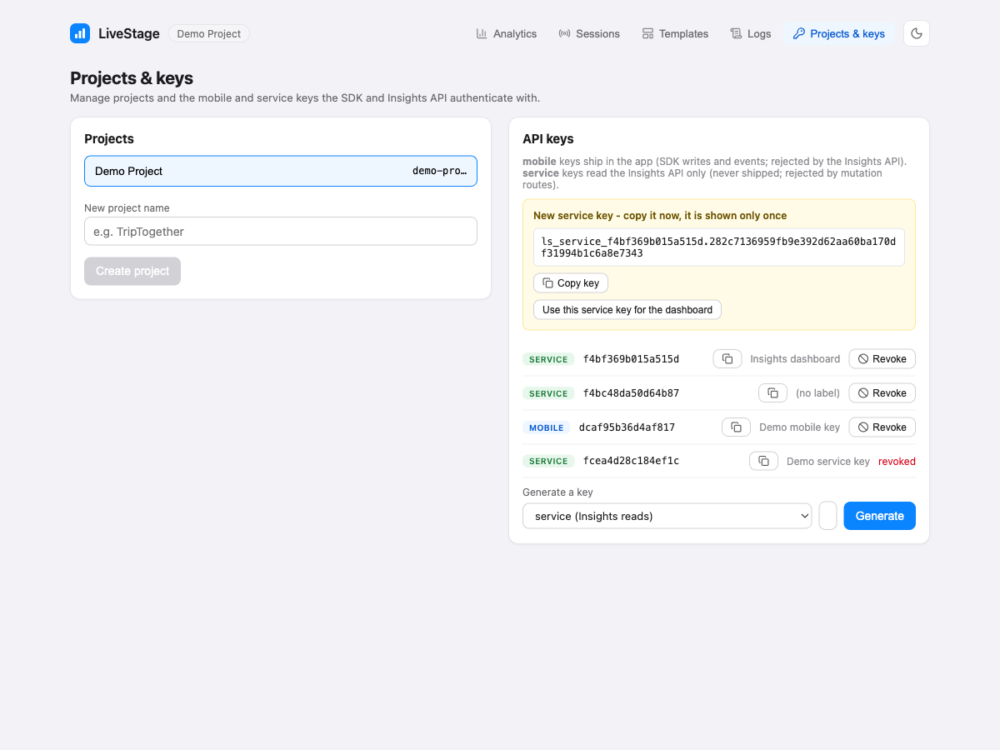
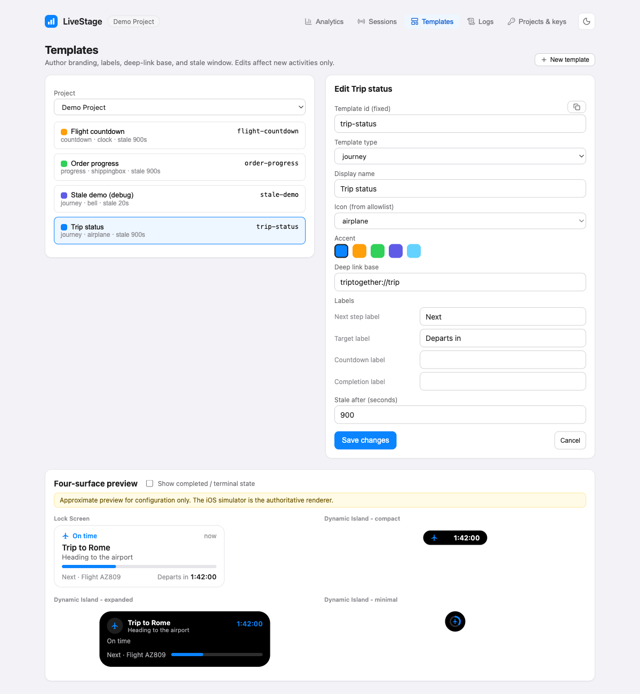
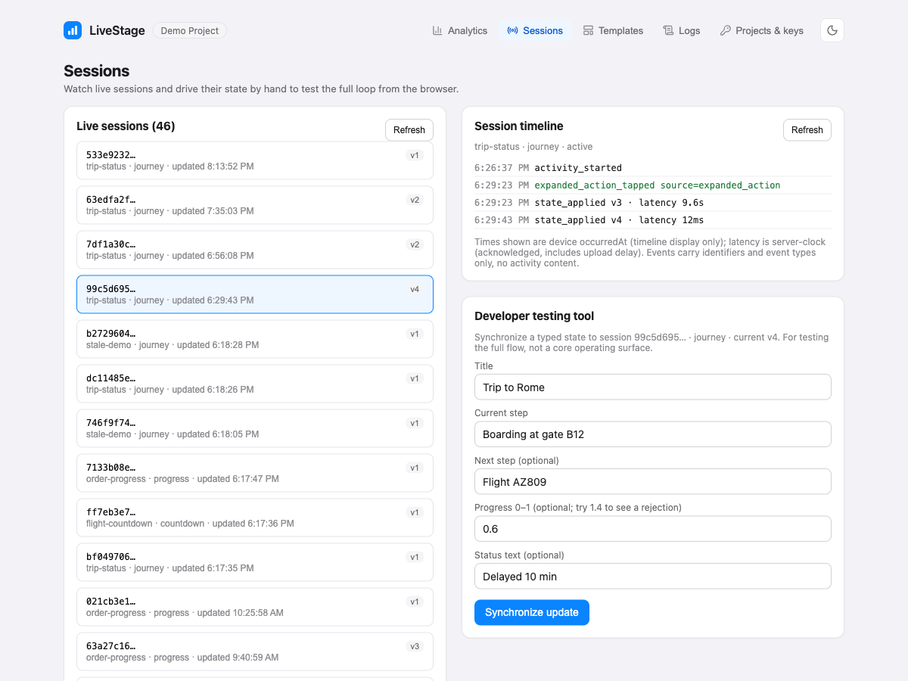
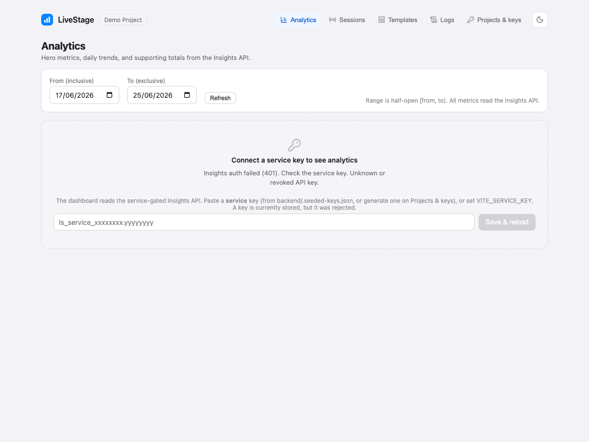
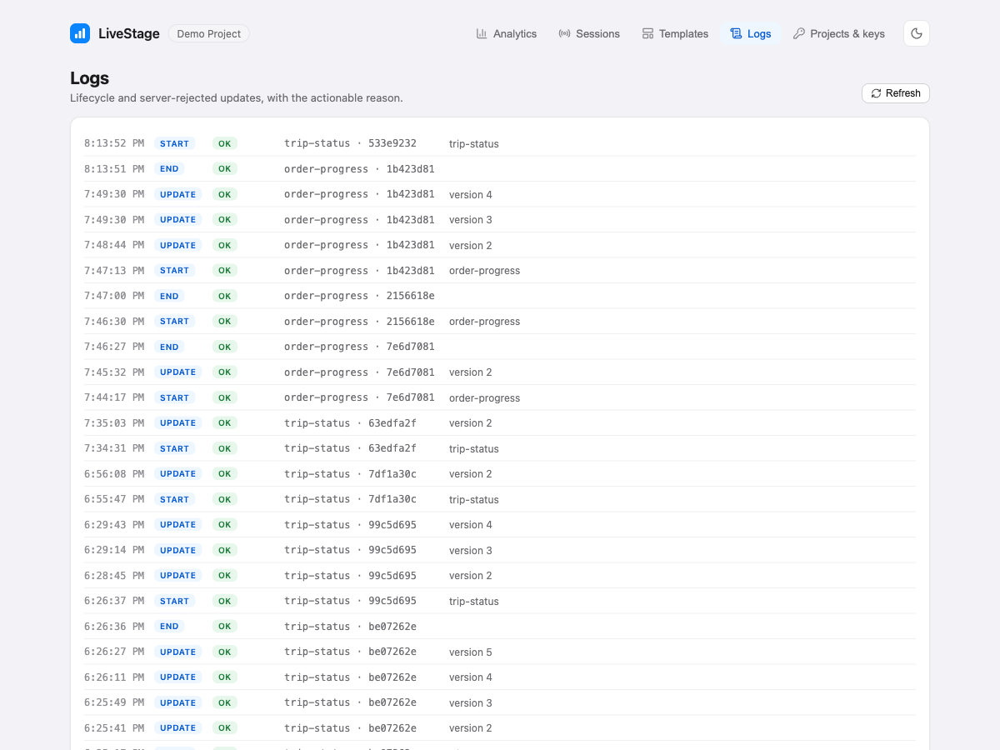

The portal is the browser-based developer console for LiveStage. It does not render Live Activities
(that is the iOS widget extension's job) and it is not required at runtime by the SDK. Its job is to
let you, the developer, do four things without writing code:

1. **Create the project and API keys** the SDK and the Insights API authenticate with.
2. **Author and edit templates** (the branding, labels, deep-link base, and stale window).
3. **Watch live sessions and drive their state by hand** to test the full loop from the browser.
4. **Read the analytics** the SDK reported, as a dashboard and a per-session timeline.

Everything the portal shows comes from the backend over HTTP. The portal talks to the admin plane
with the admin token for management screens, and to the Insights API with a `service` key for the
analytics screens. It never holds a mobile key.

## Running it

```sh
cd portal
npm install
npm run dev      # http://localhost:5173
```

Config is in `portal/src/config.ts`: `API_BASE` (default `http://localhost:8787`) and `ADMIN_TOKEN`
(default `dev-admin-token`, local-demo-only), overridable with `VITE_API_BASE` and
`VITE_ADMIN_TOKEN`. Start the backend first.

## The five tabs

### Projects and keys

This is where authentication comes from, so it is the first stop on a fresh setup. It uses the admin
token. Here you:

- See the project (the demo seed creates one for you).
- Generate API keys. There are two types, and the distinction matters:
  - A **mobile** key ships inside your app. The SDK uses it to start, update, and end activities and
    to upload events. The Insights API rejects it.
  - A **service** key reads the Insights API. It is server-side only and must never ship in an app.
    Activity-mutation routes reject it.
- A key's secret is shown **exactly once** at creation; only its hash is stored. Copy it then. The
  key format is `ls_<type>_<id>.<secret>`.
- You can point the analytics dashboard at a generated service key; the portal stores it in this
  browser's local storage so the Analytics tab can call the Insights API.



If you ran `npm run seed`, the mobile key, service key, and admin token are already printed to the
console and written to `backend/.seeded-keys.json`, so you may not need to generate anything by hand.

### Templates

Where you author the thing the SDK renders. A template is the immutable-at-start configuration for an
activity: its `type` (journey, countdown, or progress), display name, icon, accent color, deep-link
base, region labels, optional countdown `zeroStateLabel`, and the `staleAfterSeconds` window.



- Create or edit a template. The server validates your input: the icon against an allowlist, the
  accent against the palette, the type, and field lengths. Invalid input is rejected with a reason.
- The `templateId` you set here is the string you pass to `LiveStage.start(templateId:)` in the app.
- Editing a template affects **new** activities only. A running activity froze its config at start and
  is not changed by a later edit (intentional, by spec).
- The authoritative preview of how a template looks is the iOS simulator. The portal's preview is a
  convenience, not the renderer; the native SwiftUI in `LiveStageUI` owns the pixels.

### Sessions

The live view of the running service and the main testing tool. It has three parts:

- **The live-sessions list** - every server session and its status (`active` or `ended`), version,
  template, and last-updated time. Server lifecycle is `active | ended` only; `stale` and `dismissed`
  are local device reality, not server-known in V1.
- **The typed update form** - pick an active session and submit a new typed state. This PATCHes the
  session on the backend, bumps the server version, and the running app applies it within one poll
  interval (8s default). This is the quickest way to see the loop work end to end.
- **The per-session event timeline (the session explorer)** - the ordered analytics events for one
  session (started, state applied, opened, expanded action, ended), with the acknowledged sync latency
  per applied version. Identifiers, types, and timestamps only, never any of the user's state content.



### Analytics

The dashboard, and the console's centerpiece. It reads the service-gated Insights API and shows:

- The **four hero metrics**, each next to its raw numerator and denominator so the number is
  auditable: apply-success rate, acknowledged sync latency (average and median), interaction rate, and
  update-rejection rate.
- A **per-day time-series chart** for a chosen metric over a date range.
- **Supporting totals**: sessions started and ended, opens, expanded action taps, unique
  installations, updates applied, accepted and rejected updates, update attempts, and sync failures.


The labels follow the honest-metrics rules: interactions and opens (never "views"), installations
(never "people" or "users"), acknowledged latency from the server clock, and a secondary, honestly
named `lateApplicationRate` (not a "stale rate"). To use the dashboard you need a `service` key set; a
mobile key is rejected here by design. See [Analytics and metrics](/LiveStage/analytics/) for what
each number means.

Before a service key is set, the dashboard shows an empty state prompting you to add one:



### Logs

A plain operational log of lifecycle and rejection events: start, update, end, and server-rejected
updates, each with an actionable reason. This is the fastest place to see *why* a mutation was
rejected when the demo app or your code reports an error.



## A typical first session in the portal

1. **Projects and keys**: confirm the seeded project, copy the service key, and set it for the
   dashboard.
2. **Templates**: confirm `trip-status` exists (or create your own), and note its `templateId`.
3. Run the demo app (or your app) and `LiveStage.start(templateId:)` with that id.
4. **Sessions**: find the new active session, submit a typed update, and watch the activity change on
   the device within one poll.
5. Tap the activity on the device to record an open.
6. **Analytics**: see opens and the interaction rate move; open the session in the explorer to see the
   event timeline and the acknowledged latency.
7. **Logs**: if anything was rejected, read the reason here.
