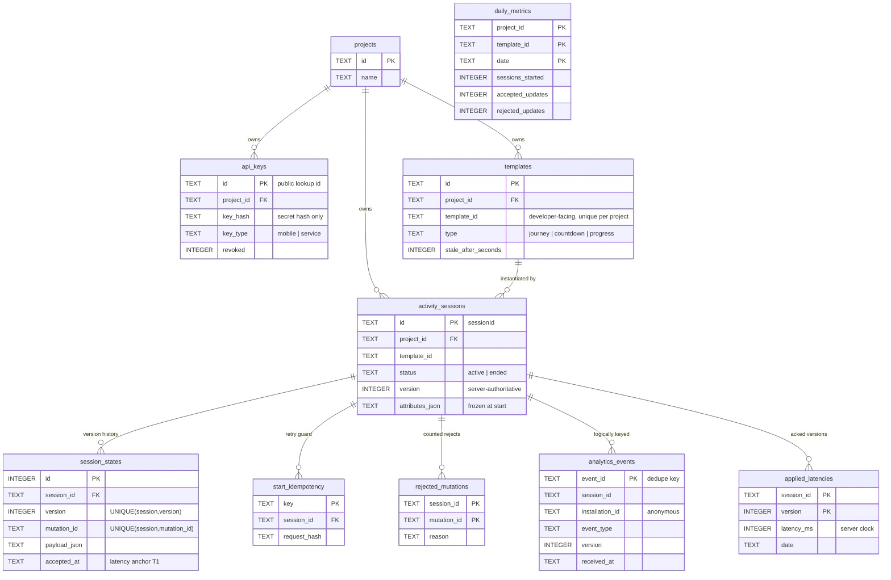

The backend uses one SQLite file (`backend/livestage.db`, gitignored; tests run in-memory). The
schema lives in `backend/src/db/schema.sql`. It has three groups of tables: slow-changing
configuration, the live-activity runtime state, and the two-level analytics store.

The analytics tables are keyed on `project_id` / `session_id` for read performance but are not
FK-enforced against the live tables, so raw event history survives independently. Foreign keys are
enforced on the configuration and live-state tables.

## Configuration and identity

The slow-changing setup data the portal manages:

- `projects` - one row per developer project.
- `api_keys` - the keys, by `key_type` (`mobile` | `service`). Only the secret's **hash** is stored,
  with the public lookup id, so the server resolves one row by id and verifies, never scanning hashes.
- `templates` - each template's type, branding, labels, deep-link base, `zero_state_label`, and
  `stale_after_seconds`.

## Live activity state

The runtime source of truth:

- `activity_sessions` - one row per session (`sessionId`): template, status (`active` | `ended`),
  current `version`, timestamps, and `attributes_json` frozen at start.
- `session_states` - the full version history of typed payloads per session, each with its
  `accepted_at` (the server clock, used as the latency anchor). Unique by `(session, version)` and by
  `(session, mutation_id)` so a retried update never creates a duplicate version.
- `start_idempotency` and `rejected_mutations` - make retries safe: a repeated `start` returns the
  original session, and a rejected update is counted once per `(session, clientMutationId)`.
- `logs` - lifecycle and rejection log rows the portal's Logs tab reads.

## Analytics

Two levels, never user content (see the [honest-metrics rules](/LiveStage/analytics/)):

- `analytics_events` - the append-only raw event history. Each row is identifiers and types only:
  `event_id`, `session_id`, `installation_id`, `template_id`, `event_type`, `version`, the device
  `occurred_at`, the server `received_at`, and non-personal `metadata_json`. No trip titles,
  locations, or status text ever land here; that content stays in `session_states`.
- `daily_metrics` - pre-aggregated per `(project, template, date)` additive totals, used for the
  daily chart rows and additive sums.
- `applied_latencies` - one row per acknowledged `(session, version)` with the server-clock latency,
  the raw source for the median latency hero.

The Insights API **computes** from these tables (range heroes from raw events and latencies, daily
charts from `daily_metrics`); it never echoes raw rows back to the developer. For exactly how a raw
event becomes a metric, and why the two-level split exists, see
[Analytics and metrics](/LiveStage/analytics/).
