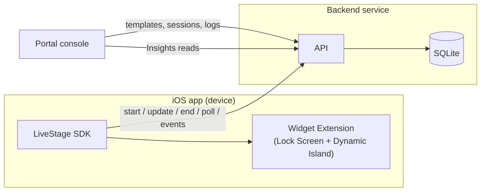

import { Card, CardGrid, LinkCard } from '@astrojs/starlight/components';
import { Image } from 'astro:assets';
import shotAnalytics from '../../assets/screenshots/04-analytics-populated.png';
import shotEditor from '../../assets/screenshots/03-template-editor-preview.png';
import shotSessions from '../../assets/screenshots/05-session-timeline.png';
import lockJourney from '../../assets/screenshots/07-lockscreen-journey.png';
import lockCountdown from '../../assets/screenshots/08-lockscreen-countdown.png';
import lockProgress from '../../assets/screenshots/09-lockscreen-progress.png';

## What LiveStage is

LiveStage is a guided-integration iOS SDK **and** analytics service for adding configurable
Live Activities. A developer picks one of three semantic templates, supplies typed state, and the
SDK renders it natively across every surface. The SDK also reports lifecycle, delivery, and
interaction events; the backend validates, stores, and aggregates them; and an Insights API returns
statistics to the developer. Content, branding, and lifecycle are managed from a developer console
(the portal) that visualizes those same APIs.

Stated precisely: LiveStage is **server-configurable and state-driven, with native layouts compiled
into the SDK**. The Live Activity views are native SwiftUI compiled into your widget extension, so a
server cannot ship layout code. The server controls which template, the typed state, the branding,
and the lifecycle. The SDK owns the pixels.

The three templates, rendered natively on the Lock Screen:

  <figure>
    <Image src={lockJourney} alt="A Journey activity on the Lock Screen, showing a trip with progress and time to arrival" />
    <figcaption>Journey</figcaption>
  </figure>
  <figure>
    <Image src={lockCountdown} alt="A Countdown activity on the Lock Screen, counting down to a target time" />
    <figcaption>Countdown</figcaption>
  </figure>
  <figure>
    <Image src={lockProgress} alt="A Progress activity on the Lock Screen, with a progress bar and current stage" />
    <figcaption>Progress</figcaption>
  </figure>

### What LiveStage saves you from building

A production Live Activity is more than a SwiftUI view. LiveStage gives you the parts that are tedious
to build and easy to get wrong, so you supply typed state and read results:

- The ActivityKit state plumbing (request, content updates, lifecycle, the activity-id mapping).
- The Lock Screen and Dynamic Island layouts, across all three island presentations.
- Backend session and version management, with forward-only, server-authoritative state.
- Update idempotency, retry with backoff, and offline event upload.
- Analytics aggregation behind an Insights API, with honest metrics only.
- A developer console for authoring templates and testing live updates by hand.

<CardGrid stagger>
  <Card title="Three templates" icon="seti:swift">
    Journey, Countdown, and
    Progress. Each renders across the Lock Screen and all three
    Dynamic Island presentations from one typed state.
  </Card>
  <Card title="Seven-function API" icon="setting">
    `configure`, `start`, `update`, `end`, `fetchConfiguration`, `status`, `handleDeepLink`. That is
    the entire developer-facing surface.
  </Card>
  <Card title="A real service loop" icon="bars">
    Render and update, report events, aggregate, Insights API, visualize. The closed loop is what
    makes LiveStage a service, not just a UI library.
  </Card>
  <Card title="Honest analytics" icon="approve-check">
    Interactions and opens, distinct installations, acknowledged sync latency. Never views,
    impressions, or dwell time, because ActivityKit cannot measure them.
  </Card>
</CardGrid>

## How it works, end to end

1. **Author once.** In the portal you create a project, generate keys, and define a template.
2. **Start an activity.** The app calls `start`. The SDK validates state, creates the server session,
   requests the ActivityKit activity, and begins polling.
3. **The server is authoritative.** State changes are versioned, forward-only, from your app or the
   portal.
4. **The SDK polls and applies.** Every poll interval (8s default) it pushes any newer version to the
   activity, which re-renders.
5. **The device reports events.** The SDK queues typed analytics events and uploads them in batches.
6. **The backend aggregates.** It dedupes, stores raw history, and rolls up daily aggregates.
7. **You read the result.** The Insights API returns statistics, and the portal visualizes them.

## Where to go next

<CardGrid>
  <LinkCard title="Quickstart" href="/LiveStage/quickstart/" description="Render your first Live Activity in about five minutes." />
  <LinkCard title="Getting started" href="/LiveStage/getting-started/" description="The full eight-step integration into a blank app." />
  <LinkCard title="Templates" href="/LiveStage/templates/" description="Journey, Countdown, and Progress field schemas." />
  <LinkCard title="API reference" href="/LiveStage/api-reference/" description="The seven public functions and their types." />
  <LinkCard title="Developer console" href="/LiveStage/console/" description="Projects, keys, templates, sessions, analytics, logs." />
  <LinkCard title="Analytics and metrics" href="/LiveStage/analytics/" description="The four hero metrics and the honest-metrics rules." />
</CardGrid>

## See the console

  <figure>
    <Image src={shotAnalytics} alt="Analytics dashboard with hero metrics and a daily time-series chart" />
    <figcaption>Analytics dashboard with the four hero metrics</figcaption>
  </figure>
  <figure>
    <Image src={shotEditor} alt="Template editor with a four-surface preview" />
    <figcaption>Template editor and four-surface preview</figcaption>
  </figure>
  <figure>
    <Image src={shotSessions} alt="Session explorer event timeline" />
    <figcaption>Session explorer and event timeline</figcaption>
  </figure>

