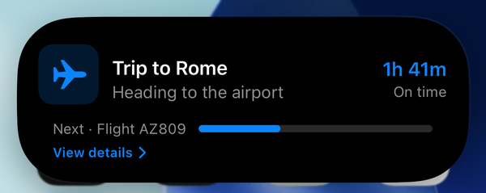
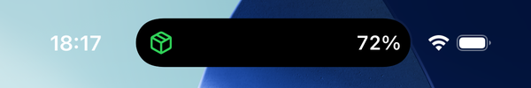
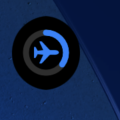

LiveStage ships three semantic templates. You pick one per activity, supply its typed state, and the
SDK renders it natively across the Lock Screen and all three Dynamic Island presentations. You do not
choose regions or toggle fields; **field visibility is driven by which optional values you supply**,
and the layout, priority, and fallbacks are fixed in `LiveStageUI`.

Each template shares one visual system but has its own character through an accent color and icon:

| Template | Accent | Icon | Best for |
| --- | --- | --- | --- |
| <span class="ls-accent journey" />Journey | Blue (`#0a84ff`) | airplane | trips, deliveries, rides, multi-stage processes |
| <span class="ls-accent countdown" />Countdown | Orange (`#ff9f0a`) | clock | flights, events, appointments |
| <span class="ls-accent progress" />Progress | Green (`#30d158`) | shipping box | uploads, food prep, processing, tasks |

The typed state for each is a Swift struct in `LiveStageModels`, wrapped by the `TemplatePayload`
enum (`.journey`, `.countdown`, `.progress`). Required fields are always shown; optional fields
appear only when you supply them.

## Journey

A trip with a title, current step, optional next step, progress, target time, and status.

```swift
public struct JourneyState: Codable, Hashable, Sendable {
    public let title: String        // required
    public let currentStep: String  // required
    public let nextStep: String?    // optional
    public let progress: Double?    // optional, 0...1
    public let targetDate: Date?    // optional
    public let statusText: String?  // optional
}
```

| Field | Type | Required | Notes |
| --- | --- | --- | --- |
| `title` | String | yes | The headline, e.g. "Trip to Rome". |
| `currentStep` | String | yes | What is happening now, e.g. "Heading to the airport". |
| `nextStep` | String? | no | The upcoming step, shown when present. |
| `progress` | Double? | no | 0...1. Drives the progress bar and the minimal ring. |
| `targetDate` | Date? | no | Arrival or target time; rendered as a relative countdown. |
| `statusText` | String? | no | A short status, e.g. "On time" or "Delayed 10 min". |

```swift
.journey(JourneyState(
    title: "Trip to Rome",
    currentStep: "Heading to the airport",
    nextStep: "Flight AZ809",
    progress: 0.35,
    targetDate: Date().addingTimeInterval(3600),
    statusText: "On time"
))
```


## Countdown

A target time that ticks on-device, with a zero-state label when it reaches zero. `targetDate` is the
core of the template and is required.

```swift
public struct CountdownState: Codable, Hashable, Sendable {
    public let title: String        // required
    public let subtitle: String?    // optional
    public let targetDate: Date     // required
    public let statusText: String?  // optional
    public let location: String?    // optional
}
```

| Field | Type | Required | Notes |
| --- | --- | --- | --- |
| `title` | String | yes | The headline, e.g. "Flight to Rome". |
| `subtitle` | String? | no | A secondary line, e.g. "Gate B12". |
| `targetDate` | Date | yes | The moment the countdown ticks toward, on-device. |
| `statusText` | String? | no | A short status, e.g. "On time". |
| `location` | String? | no | A place, e.g. "Terminal 3". |

When the countdown reaches zero it shows the template's `zeroStateLabel` (configured in the portal,
for example "Boarding now") rather than a negative timer. Semantic transitions such as "Departed" or
"Delayed" require an explicit `update`; the countdown reaching zero does not change them on its own.

```swift
.countdown(CountdownState(
    title: "Flight to Rome",
    subtitle: "Gate B12",
    targetDate: Date().addingTimeInterval(1800),
    statusText: "On time",
    location: "Terminal 3"
))
```


## Progress

A staged task with a 0...1 progress value and an estimated completion time. `progress` is required.

```swift
public struct ProgressState: Codable, Hashable, Sendable {
    public let title: String                   // required
    public let currentStage: String?           // optional
    public let progress: Double                // required, 0...1
    public let estimatedCompletionDate: Date?  // optional
    public let detailText: String?             // optional
}
```

| Field | Type | Required | Notes |
| --- | --- | --- | --- |
| `title` | String | yes | The headline, e.g. "Preparing your order". |
| `currentStage` | String? | no | The current stage, e.g. "Packing". |
| `progress` | Double | yes | 0...1. Drives the progress bar and the minimal ring. |
| `estimatedCompletionDate` | Date? | no | When it is expected to finish. |
| `detailText` | String? | no | A short detail, e.g. "3 items left". |

At `progress` 1.0 the template renders its completed look (a check and a muted accent). Like the other
templates, visual completion does **not** lock the activity; updates are accepted until you call
`end`.

```swift
.progress(ProgressState(
    title: "Preparing your order",
    currentStage: "Packing",
    progress: 0.72,
    estimatedCompletionDate: Date().addingTimeInterval(600),
    detailText: "3 items left"
))
```


## How a template renders across surfaces

One typed state fills four presentations. The SDK shows the single most useful value for each size:

- **Lock Screen card** - the fullest view: title, current step or subtitle, progress bar when
  present, status, and a relative time.
- **Dynamic Island compact** - the icon plus one glanceable trailing value (a countdown, a
  percentage, or a time).
- **Dynamic Island expanded** - title, the key secondary line, a progress bar when present, and
  status.
- **Dynamic Island minimal** - the icon, with a progress ring when progress is present. Minimal only
  appears when two or more activities are live at once.

The three Dynamic Island presentations. The expanded card (a Journey activity):



The compact pill (a Progress activity, showing one glanceable value) and the minimal ring (a Journey activity). The minimal presentation appears only when two or more activities are live at once:





Long-pressing the compact island expands it to the full card:


The native SwiftUI in `LiveStageUI` owns these layouts. A server configures the template, branding,
and state; it never ships layout code.

## Template configuration

Beyond the per-activity state above, each template has static configuration authored in the portal
and fetched by `fetchConfiguration`:

```swift
public struct TemplateConfiguration: Codable, Hashable, Sendable {
    public let templateId: String
    public let templateType: TemplateType   // journey | countdown | progress
    public let displayName: String
    public let icon: String                 // allowlisted SF Symbol identifier
    public let accentStyle: AccentStyle      // from the fixed palette
    public let deepLinkBase: String
    public let labels: TemplateLabels        // includes the countdown zeroStateLabel
    public let staleAfterSeconds: Int        // staleDate = lastUpdatedAt + this
}
```

The `templateId` is the string you pass to `start`. Editing a template in the portal affects **new**
activities only; a running activity froze its configuration at start. See the
[Developer console](/LiveStage/console/) guide for authoring templates.
